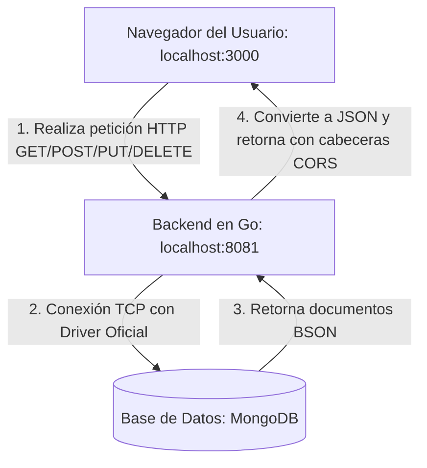

# TaskSphere - SPA (React + Go + MongoDB + Docker Compose)

TaskSphere es un gestor de tareas moderno y premium desarrollado como una aplicación de página única (SPA). Utiliza un backend de alto rendimiento escrito en Go, persistencia de datos en MongoDB y un frontend interactivo diseñado con React y Vite utilizando principios de Glassmorphism (tarjetas de cristal con efecto blur) y diseño responsivo. Todo el entorno está orquestado de manera sencilla utilizando Docker Compose.

---

## 🚀 Arquitectura del Proyecto

El proyecto está dividido en tres servicios principales orquestados por Docker:

1. **Frontend (React + Vite):**
   - Interfaz de usuario interactiva y fluida.
   - Carga inicial de datos mediante hooks (`useEffect`).
   - Estilizado premium con Vanilla CSS (soporte para modo oscuro por defecto, gradientes y micro-animaciones).
   - Servido en el puerto `3000`.

2. **Backend (Go / Golang):**
   - Servidor HTTP nativo ágil y ligero.
   - Conexión al controlador oficial de MongoDB para persistencia.
   - Middleware de CORS integrado para permitir peticiones desde el frontend.
   - Expuesto en el puerto `8081` (mapeado al puerto `8080` interno del contenedor).

3. **Base de Datos (MongoDB):**
   - Motor de base de datos NoSQL para almacenar y consultar las tareas.
   - Volumen de Docker configurado para garantizar la persistencia de datos localmente.
   - Expuesto en el puerto `27018` (mapeado al puerto `27017` interno).

---

## 📂 Estructura del Repositorio

```text
proyecto-spa/
├── docker-compose.yml     # Orquestación de contenedores
├── README.md              # Documentación del proyecto
├── backend/               # Servidor de API en Go
│   ├── main.go            # Inicialización y enrutador
│   ├── go.mod             # Módulo de dependencias de Go
│   ├── go.sum             # Sumas de comprobación del módulo
│   ├── Dockerfile         # Construcción optimizada multi-etapa
│   ├── handlers/          # Lógica de controladores HTTP (CRUD)
│   │   └── task_handler.go
│   └── models/            # Esquema de datos para MongoDB
│       └── task.go
└── frontend/              # Aplicación cliente React
    ├── package.json       # Dependencias de npm
    ├── vite.config.js     # Configuración del servidor Vite
    ├── index.html         # Cascarón HTML5
    ├── Dockerfile         # Dockerfile de entorno de desarrollo
    └── src/
        ├── main.jsx       # Punto de entrada de React
        ├── App.jsx        # Lógica de la SPA (fetching y formularios)
        ├── index.css      # Sistema de diseño y estilos globales
        └── components/    # Componentes reutilizables
            └── TaskCard.jsx
```

---

## 🛠️ Requisitos Previos

Para ejecutar este proyecto, asegúrate de tener instalado en la computadora destino:
- [Docker Desktop](https://www.docker.com/products/docker-desktop/) (que incluye Docker Engine y Docker Compose).

---

## 🏁 Cómo ejecutar el proyecto en otra PC

Para llevar el proyecto a otra computadora y ejecutarlo exactamente igual, sigue estos pasos:

### Paso 1: Copiar el código del proyecto
* **Opción A (Git):** Sube el código a un repositorio Git (como GitHub) y clónalo en la nueva PC:
  ```bash
  git clone <url-de-tu-repositorio>
  cd proyecto-spa
  ```
* **Opción B (Archivo comprimido):** Comprime la carpeta `proyecto-spa` (omitiendo la carpeta oculta `.git` si existe) en un archivo `.zip`, llévalo a la otra PC y descomprímelo.

### Paso 2: Iniciar Docker Desktop
Asegúrate de que la aplicación **Docker Desktop** esté abierta y ejecutándose en la barra de tareas de la otra computadora.

### Paso 3: Levantar los contenedores
Abre una terminal (PowerShell, Git Bash o CMD) en la raíz del proyecto en la otra PC y ejecuta:
```bash
docker compose up --build
```
Docker se encargará de forma automática de:
1. Descargar la imagen de MongoDB (`mongo:latest`).
2. Descargar la imagen de compilación de Go y compilar el backend.
3. Instalar todas las dependencias de Node.js del frontend.
4. Crear la red interna para que se comuniquen y montar el volumen de persistencia.

Una vez que termine, abre el navegador en la otra PC en: **[http://localhost:3000](http://localhost:3000)**.

---

## 💡 ¿Qué hace y cómo funciona la aplicación?

Esta aplicación es un **Gestor de Tareas interactivo** (CRUD) que permite crear, visualizar, marcar como completadas y eliminar tareas.

### Flujo de Funcionamiento Técnico:



1. **Carga Inicial (Read):**
   Al ingresar a la web (`http://localhost:3000`), el frontend en React ejecuta el hook `useEffect` y realiza una petición HTTP `GET` hacia `http://localhost:8081/api/tasks`. El backend en Go recibe esta petición, consulta la base de datos MongoDB usando su driver oficial, obtiene los registros, los formatea como un arreglo JSON y los devuelve al navegador para que React los dibuje en las tarjetas.

2. **Creación de Tareas (Create):**
   Al rellenar el formulario y presionar "Añadir Tarea", el navegador envía una petición `POST` con los datos (Título y Descripción) en formato JSON al backend. El backend genera un identificador único (ID de MongoDB), establece la fecha de creación y guarda la tarea en la base de datos. Finalmente, retorna la tarea recién creada al frontend para que este actualice la interfaz sin necesidad de recargar la página entera (comportamiento SPA).

3. **Actualización (Update):**
   Al presionar el círculo de completar en una tarjeta, se envía una petición `PUT` hacia `http://localhost:8081/api/tasks?id=<ID_DE_TAREA>` con el nuevo estado. El backend actualiza el campo `completed` de ese documento específico en la base de datos.

4. **Eliminación (Delete):**
   Al presionar el icono de basura, se envía una petición `DELETE` hacia `http://localhost:8081/api/tasks?id=<ID_DE_TAREA>`. El backend busca el documento por su ID y lo remueve definitivamente de MongoDB.

5. **Persistencia (Volumen de Docker):**
   Los archivos de la base de datos MongoDB no se guardan temporalmente dentro del contenedor, sino que se enlazan a un volumen físico del disco duro de la PC (`mongo-data`). Por esta razón, aunque apagues la computadora o destruyas los contenedores Docker, los datos permanecerán seguros y se volverán a cargar la próxima vez que inicies el proyecto.
